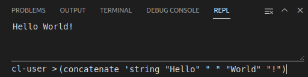
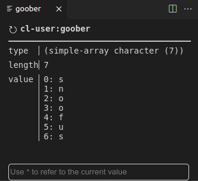
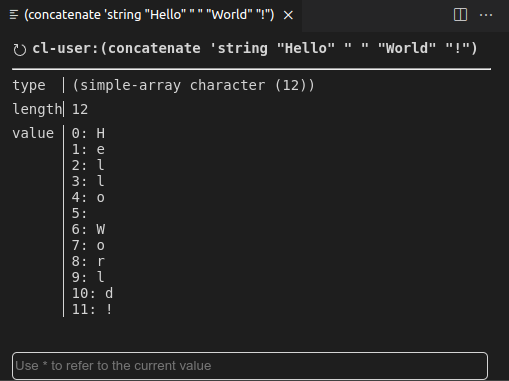

# Alive: The Average Lisp VSCode Environment

An attempt to create a Common Lisp extension for VSCode. It's still a work in progress, though getting better.

The name is partly a self-deprecating take on SLIME's name, but also reflects the goal of the project which is to reach Minimum Viable Product status. For VSCode language extensions, there is a lot that is expected for the bare minimum, including formatting, code completion, syntax highlighting, etc.

The LSP server that the extension relies on currently only supports [Steel Bank Common Lisp (SBCL)](https://www.sbcl.org/). The extension isn't intended to be compiler-specific, but it is at the moment. The server can be found here, https://github.com/nobody-famous/alive-lsp

## Extension Requirements

The following must be installed prior to using the Alive extension. It is okay for these to be installed after the extension is installed, although you may need to reload your VS Code window after doing so.

* [ASDF](https://asdf.common-lisp.dev/) (*not* [asdf](https://asdf-vm.com/)): version 3.3.3 or later.

  - Note: SBCL comes with ASDF already installed.

* The LSP server uses the following Common Lisp libraries, which need to be installed for it to work.
  - Libraries: 

    - bordeaux-threads
    - usocket
    - cl-json
    - flexi-streams

  - If you are new to Common Lisp, then the [Quicklisp](https://www.quicklisp.org/beta/) library manager is recommended. Follow the installation instructions to install Quicklisp. Then the above libraries can be installed by executing the following expressions in an `sbcl` shell:

    - `(ql:quickload "bordeaux-threads")`
    - `(ql:quickload "usocket")`
    - `(ql:quickload "cl-json")`
    - `(ql:quickload "flexi-streams")`


    Make sure you run `(ql:add-to-init-file)` or add `(load "~/quicklisp/setup.lisp")` to the `~/.sbclrc` file to make sure these dependencies are loaded on startup.

    <details>
    <summary>An example SBCL and Quicklisp session (where `...` stands for a bunch of stuff printed to the console)</summary>

    ```lisp
    > sbcl
    ...
    * (ql:quickload "bordeaux-threads")
    ...
    * (ql:quickload "usocket")
    ...
    * (ql:quickload "cl-json")
    ...
    * (ql:quickload "flexi-streams")
    ...
    ```
    </details>

## Features

-   Syntax highlighting
-   Code completion
-   Code formatter
-   Snippets
-   REPL integration
-   REPL history
-   Inline evaluation
-   Macro expansion
-   Jump To Definition
-   Expand Selection
-   Document Symbols

## Extension Settings

This extension contributes the following settings:

-   `alive.lsp.install.path`: Directory where the LSP source code is installed
-   `alive.lsp.startCommand`: Command used to start the LSP server
-   `alive.lsp.remote.host`: Host of the LSP server to connect to
-   `alive.lsp.remote.port`: Port of the LSP server to connect to
-   `alive.format.indentWidth`: Default indentation width
-   `alive.enableDiagnostics`: If true (the default), automatically update diagnostics using a temporary file to not force saving the file or creating extra fasl files. If false, compile file or load file need to be used. If "autoSave", the file will be automatically saved and compiled.
-   `alive.packageTree.separator`: String, or list of strings, to split package names in the package view.

Syntax highlighting is done using semantic tokens. This is mainly to avoid regex hell. The following semantic tokens are added:

-   `parenthesis`: Color to use for parenthesis
-   `symbol`: Color to use for symbols

## VSCode Settings

-   `editor.formatOnType`: When set to true, will indent the new line per lisp formatting when enter is pressed
-   `editor.wordSeparators`: Sets a regex used to determine word boundaries. A decent setting is ```"editor.wordSeparators": "`|;:'\",()"```


## REPL Integration

The current idea is to use VSCode as the REPL, leveraging VSCode features to give a visual insight into the running image.

-   There is a REPL console that mimics the debug console.
-   User input requested by the REPL is prompted with a text box.
-   A Lisp tree view is added that shows the REPL history, threads, packages, and defined ASDF systems.
-   History items can be re-run by using the up/down arrow keys in the REPL console, using the re-run action in the history tree view, or using "REPL History" from the command palette.

### Form Evaluation

At the bottom of the VSCode workbench, in the Panel area,
is a **REPL** view with a user input area at the bottom.
Results of execution of any form by the REPL are shown in this panel.
The user may also enter ad hoc forms in the user input area at the bottom of the view.

For example:



Forms entered by the user are also added to a history list.
The up and down arrows can be used in the user input area to choose a previous form to be (possibly edited and) reevaluated.
The history list is also shown in the **REPL HISTORY** view in the Lisp Tree View described below.

Forms sent for evaluation by the user are run in their own thread. The threads have names like `"N - $/alive/eval"` where N is a number. The number is used to try to keep the names unique since getting the underlying system id of the threads isn't as easy as it sounds.
If one of them gets stuck in an infinite loop or something,
it should be safe to terminate the thread using the remove icon
()
on the appropriate thread entry in the **THREADS** view in the Lisp Tree View described below.

### Inspection

An inspector can be opened by clicking `Inspect` at the bottom of the hover text for a symbol, for example:



The same view can be opened by evaluating an expression in the **INSPECTOR** view in the Lisp Tree View described below.
In either case the same inspector view is opened in a panel
on the right side of the workbench.

At the bottom of each inspector view is a text field that can be used to evaluate expressions.
The value in the inspector can be referenced with `*`.
For example, `(format T "~A" *)` will print the current value in the REPL window.

There is also an inspector for macros, using the Inspect Macro command. An inspector opens that shows one level of expansion for the macro at the current cursor position. It has a button to refresh the inspector or increment the level of expansion by one. When an expression is sent for evaluation, such as redefining the macro, the expansion is refreshed back to one level.

### Lisp Tree View

The Lisp Tree View is invoked by clicking on the following icon in the Activity Bar on the left of the VSCode workbench:


There are a number of views in the Lisp Tree View to display and
manipulate different aspects of your current Lisp REPL.

#### REPL History

The **REPL HISTORY** view displays all of the Lisp forms evaluated manually by the user in the provided REPL panel described above.
The clear all icon () at the right of the title bar for this view clears the history.

Clicking on a form in the list shows the form's containing package on the next line.

To the right of the form are three icons:

| Icon | Action |
| :-: | - |
|  | Puts the form into the entry line below the REPL and leaves it there to be edited and executed. |
|  | Sends the form to the REPL to be executed again. |
|  | Removes the item from the history. |

#### Inspector

The **INSPECTOR** view can generate an inspect panel for a symbol.
Inspection is done in the context of a specific package.
The line below the title bar displays the current package,
clicking on that line brings up a menu of packages from which to choose.

Once the package is chosen, the next line is a user entry box
into which any valid Common Lisp form may be entered.
Variable names do not need to be quoted but function names do.
More complex forms will be evaluated and the result inspected.
If the result of the expression is not `nil`, a new inspector view will be opened with the value.

For example:
```
(concatenate 'string "Hello" " " "World" "!")
```
will display as:



Inspection is discussed in more detail in the **Inspection** section below.

#### Packages

The **PACKAGES** view shows all of the packages in the REPL.
The refresh icon ()
at the right of the title bar updates the package list to be current with the REPL.
This view is not automatically updated when packages are added.

Clicking on a package in the list expands to show
all of the symbols defined in that package below the package name.
Clicking on the remove icon ()
to the right of a symbol removes that symbol.

The `alive.packageTree.separator` config setting can be used to better organize the view. If it's set to a single string, that string is used to split each package name and nests them. If it's set to an array of strings, the first one that successfully splits a package name is used for that name. Leaving it out, or setting it to `null`, uses the default of not nesting the package names.

#### ASDF Systems

The **ASDF SYSTEMS** view shows all of the ASDF systems defined in the REPL.
The refresh icon ()
at the right of the title bar updates the ASDF system list to be current with the REPL.
This view is not automatically updated when systems are added.

Clicking on the ()
to the right of a system loads that system into the REPL
by executing **Alive: Load ASDF System By Name** for that system.

#### Threads

The **THREADS** view shows all of the threads executing in the REPL.
The refresh icon ()
at the right of the title bar updates the thread list to be current with the REPL.
This may not be necessary as in at least some cases the addition
of a thread shows up automatically in this view.

Clicking on the remove icon
()
to the right of a thread kills the thread.

## Commands

### Select S-Expression (Alt+Shift+Up)

Selects the surrounding top level expression for the current cursor position.

### Send To REPL (Alt+Shift+Enter)

Sends selected text to the REPL. If nothing is selected, sends the top level form at the cursor position.

### Eval Surrounding Form

Sends selected text to the REPL. If nothing is selected, sends the immediate closing form at the cursor position.

### Trace/Untrace function (Alt+Shift+T/U)

Sends trace/untrace definition to the REPL. To list already traced functions, enter (trace) in REPL.

### Load File (Alt+Shift+L)

Load the current file into the REPL.

### Inline Evaluation (Alt+Shift+E)

Evaluate the enclosing top-level form, showing the result inline. If there is a selection, evaluates the selected code.

### Inline Eval Surrounding Form

Evaluate the immediate enclosing form at the cursor, showing the result inline. If there is a selection, evaluates the selected code.

### Clear Inline Results (Alt+Shift+C)

Clear the inline results.

### REPL History (Alt+Shift+R)

Expressions that are evaluated from the REPL window are added to the history. This command opens a quick pick selector with the history. The most recently used item is at the top, i.e. similar behavior to the Run Tasks command.

### Select Restart (Alt+Shift+<Number>)

Selects the restart with the given number for the currently visible debugger.

### Load ASDF System

Tell the REPL to load an ASDF system. A list of known systems will be given to choose from.

### Open Scratch Pad

Opens a temporary file, `{workspace}/.vscode/alive/scratch.lisp`, that can be used to evaluate expressions, making use of the normal editing features like code completion.

### Macro Expand All

Selected text is passed to macroexpand and expanded in place. If nothing is selected, the form surrounding the cursor is sent.

### Macro Expand 1

Selected text is passed to macroexpand-1 and expanded in place. If nothing is selected, the form surrounding the cursor is sent.

### Inspect Macro

An inspector is opened for the currently selected text. If nothing is selected, the form surrounding the cursor is sent.

## License

Unless otherwise noted, all files are in the Public Domain.

## Developing Alive Code

If you are interesting in making changes to Alive you should take a look at the [Development Notes](README-dev.md).

## Release Notes

No actual releases, yet.
